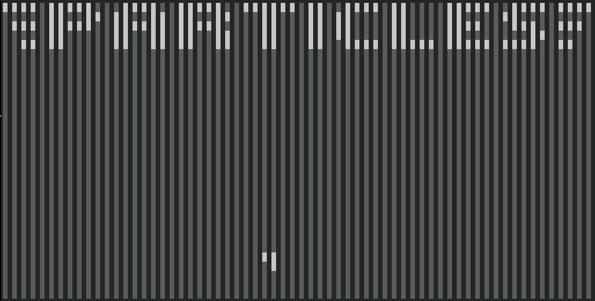
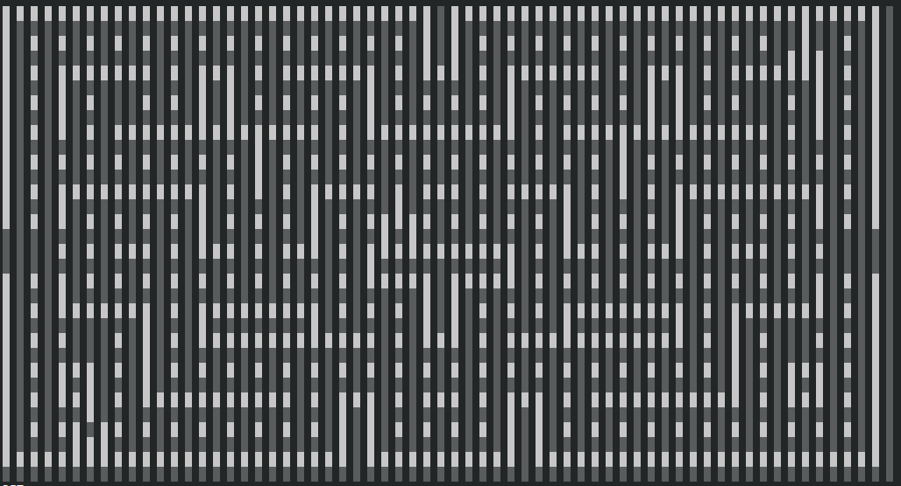

# CHP
Because I can, not because I should.

CHP is a CHIP-8 interpreter written in SPWN. Input and sound aren't supported. (For obvious reasons)

## Features
- Very slow, like extremely slow.
- Written entirely in SPWN. (Including the bitwise stuff)
- Can actually run stuff.

## Demo
Shown below is Particles.

Shown below is Blinky, this frame took 25 minutes to render for me. Your mileage may vary.

Shown below is a demo on the speed of CHP.
